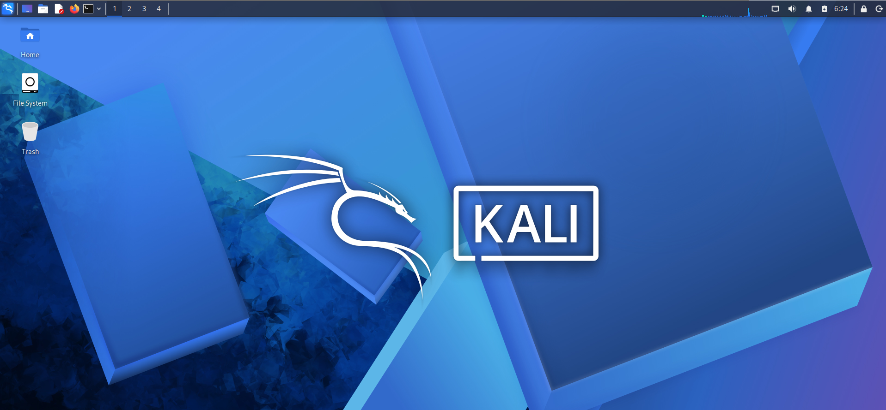

# 🛡️ Cyber Lab Setup — Week 1

## 📌 Project Overview

This project focuses on building a **virtual cybersecurity and penetration-testing laboratory** utilizing VirtualBox, Kali Linux, and Metasploitable.

The objective of this lab is to establish an isolated environment to execute network scanning, reconnaissance, vulnerability assessments, and various security-testing procedures safely and consistently.

Configured with segregated virtual machines, the setup uses Kali Linux as the primary attacker machine and Metasploitable as an intentionally vulnerable target for hands-on, ethical practice.

---

## 📌 Project Information

**Program Name:** Cybersecurity at Networkwalks | **Week:** 01 | **Project:** Cybersecurity & Pentesting Lab Setup (VirtualBox) | **Repository:** GitHub

---

## 🎯 Objectives

The main objectives of this project are to:

- Install and configure Oracle VM VirtualBox.
- Set up and configure Kali Linux as a virtual machine.
- Import and configure Metasploitable as a vulnerable target VM.
- Establish proper network configurations between the lab virtual machines.
- Verify connectivity and communication between Kali Linux and Metasploitable.
- Document the full laboratory setup process.
- Prepare the virtual environment for upcoming cybersecurity projects.

---

## 🧪 Lab Environment

| Component | Role |
|---|---|
| **Kali Linux** | Security-testing / attacker VM |
| **Metasploitable** | Intentionally vulnerable target VM |
| **VirtualBox** | Virtualization platform |

### Current Setup

- **Virtualization:** Oracle VM VirtualBox
- **Security VM:** Kali Linux
- **Target VM:** Metasploitable
- **Lab type:** Controlled virtual cybersecurity laboratory

---

## 🖥️ Kali Linux Running

The following screenshot documents Kali Linux running successfully inside VirtualBox:

