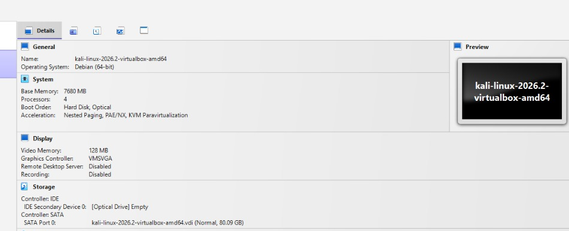

# 🛡️ Cyber Lab Setup — Week 1

## 📌 Project Overview

This project focuses on building a **virtual cybersecurity and penetration-testing laboratory** using VirtualBox, Kali Linux, and Metasploitable.

The objective of this lab is to establish an isolated environment to execute network scanning, reconnaissance, vulnerability assessments, and various security-testing procedures safely and consistently.

Configured with segregated virtual machines, the setup uses Kali Linux as the primary attacker machine and Metasploitable as an intentionally vulnerable target for hands-on, ethical practice.

---

## 📌 Project Information

**Program Name:** Cybersecurity at Networkwalks | **Week:** 01 | **Project:** Cybersecurity & Pentesting Lab Setup (VirtualBox) | **Repository:** GitHub

---

## 🎯 Objectives

The main objectives of this project are to:

- Install and configure Oracle VM VirtualBox.
- Set up and configure Kali Linux as a virtual machine.
- Import and configure Metasploitable as a vulnerable target VM.
- Establish proper network configurations between the lab virtual machines.
- Verify connectivity and communication between Kali Linux and Metasploitable.
- Document the full laboratory setup process.
- Prepare the virtual environment for upcoming cybersecurity projects.

---

## 🧪 Lab Environment

| Component | Role |
|---|---|
| **Kali Linux** | Security-testing / attacker VM |
| **Metasploitable** | Intentionally vulnerable target VM |
| **VirtualBox** | Virtualization platform |

### Current Setup

- **Virtualization:** Oracle VM VirtualBox
- **Security VM:** Kali Linux
- **Target VM:** Metasploitable
- **Lab type:** Controlled virtual cybersecurity laboratory

---

## 🖥️ Kali Linux Running

The following screenshot documents Kali Linux running successfully inside VirtualBox:


---

## 🛡️ Purpose of the Lab

This laboratory provides a secure, self-contained workspace dedicated to practical cybersecurity training and authorized vulnerability testing.

Key capabilities and practice areas include:

- Network discovery and reconnaissance
- Port scanning and service enumeration
- Vulnerability scanning and assessment
- Network traffic and packet analysis
- Web application security testing
- Ethical exploitation testing
- Tool deployment and security experimentation

⚠️ **Important:** All activities performed in this lab must strictly adhere to ethical guidelines and target only authorization-approved systems. Metasploitable contains deliberate security flaws and must remain strictly contained within your isolated virtual network.

---

### ⚙️ Lab Configuration

| 🧩 Component | ⚙️ Configuration |
| :--- | :--- |
| 🖥️ **Host OS** | Windows 10 |
| 🧰 **Hypervisor** | VirtualBox |
| 🐲 **Attacker OS** | Kali Linux |
| 🎯 **Target OS** | Metasploitable 2 |
| 🌐 **Network Type** | NAT Network |
| 🐧 **Kali IP** | 192.168.1.10 |
| 🎯 **Metasploitable IP** | 192.168.1.20 |

---

## 🛠️ Lab Setup Procedure

---

### Step 1. Install Oracle VM VirtualBox

Oracle VM VirtualBox was selected and installed as the core virtualization platform to host and manage the virtual cybersecurity environment.

**Software:**
- Oracle VM VirtualBox

VirtualBox enables multiple isolated operating systems to run concurrently on a single host, allowing safe interaction and custom network configurations between virtual machines.

---

### Step 2. Download Kali Linux

The pre-built Kali Linux virtual machine image was downloaded directly from the official Kali Linux distribution source.

**Source:**
- https://www.kali.org/

Kali Linux functions as the primary security-testing and penetration-testing platform within this laboratory environment.

---

### Step 3. Download Metasploitable

Metasploitable 2 was downloaded to serve as the intentionally vulnerable target virtual machine.

Metasploitable exposes various network services and security flaws, offering a controlled target for practical learning and ethical security testing.


---

### Step 4. Import Kali Linux into VirtualBox

The Kali Linux virtual machine was imported and configured within Oracle VM VirtualBox.

Example VM configuration:

| Setting | Value |
|----------|---------|
| RAM | 7.5 GB |
| CPU | 4 Processors |
| Network Adapter | NAT |
| Disk | 80.1 GB (Default Kali Disk) |

The virtual machine was launched successfully.



---

### Step 5. Import Metasploitable into VirtualBox

The Metasploitable virtual machine was imported and configured within Oracle VM VirtualBox.

Example configuration:

| Setting | Value |
|----------|---------|
| RAM | 512 MB – 1 GB |
| CPU | 1 Processor |
| Network Adapter | Same network as Kali |

Both virtual machines were connected to the same virtual network adapter to enable isolated inter-VM communication.

---

### Step 6. Configure VirtualBox Network

A private virtual network was configured within Oracle VM VirtualBox.

Example network setup:

| Component | Example |
|------------|------------|
| Network Type | NAT Network |
| Kali Linux | Dynamic IP |
| Metasploitable | Dynamic IP |

This configuration enables direct communication between Kali Linux and Metasploitable while keeping the lab environment safely isolated.

---

### Step 7. Verify Kali Linux Network

Open Terminal and run:

```bash
ip a
```

Expected result:

```text
IP Address:
192.168.x.x
```

---

### Step 8. Verify Network Connectivity

Test connectivity between the virtual machines by sending ICMP echo requests from Kali Linux to Metasploitable:

```bash
ping <Metasploitable-IP>
```

Expected result:

```text
64 bytes from <IP>: icmp_seq=1 ttl=64 time=0.xxx ms
```
---

### Step 9. Verify Nmap Installation

Confirm that Nmap is available on the Kali Linux system by executing:

```bash
nmap --version
```

Expected result:

```text
Nmap version displayed successfully
```

---

### Step 10. Create VirtualBox Snapshot

A clean VirtualBox snapshot was created after completing the initial installation and setup.

This enables quick restoration to a baseline state before performing future security testing exercises.

---

## 📁 Repository Structure

```text
cyber-lab-setup-week-1/
│
├── .gitignore                  # Excludes temporary VirtualBox system files
├── README.md                   # Main documentation and lab report
│
└── images/                     # Project screenshots
    ├── import-kali-linux.png   # VirtualBox Kali Linux import configuration
    └── kali-linux-running.png  # Kali Linux virtual machine running
```

---


## 🔍 Lab Verification

| ✅ Test | 📄 Command | 🎯 Expected Result |
| :--- | :--- | :--- |
| 🌐 **Check IP address** | `ip a` | Assigned Kali Linux IP displayed |
| 📡 **Test gateway** | `ping 192.168.1.1` | Continuous successful ICMP replies |
| 🌍 **Test Internet connectivity** | `ping 8.8.8.8` | Continuous successful ICMP replies |
| 🔍 **Test DNS resolution** | `nslookup google.com` | Domain successfully resolves to an IP |
| 🎯 **Target Connectivity** | `ping <Metasploitable_IP>` | Continuous successful ICMP replies |
| 🧰 **Verify Nmap** | `nmap --version` | Installed Nmap version details displayed |
| 🔄 **Verify VirtualBox snapshot** | Restore snapshot and run `ip a` | System reverts cleanly to baseline state |

### Example Verification Output

```text
IP Address:
192.168.1.10/24

Gateway:
192.168.1.1

DNS:
8.8.8.8

Metasploitable Target IP:
192.168.1.20
```
---

## 🐞 Problems Encountered & Solutions

Documenting real troubleshooting steps encountered during the laboratory setup process.

---

### Problem 1. Kali Linux Display Resolution Stuck in VirtualBox

**Symptom:** After launching Kali Linux in VirtualBox, the screen resolution was locked to a small size (e.g., 800x600) and failed to scale when resizing the window.

**Solution:**
The issue was resolved by installing the VirtualBox Guest Additions package and restarting the system:

```bash
sudo apt update
sudo apt install -y virtualbox-guest-x11
sudo reboot
```
---

### Problem 2. Network Isolation Between Kali and Metasploitable

**Symptom:** Kali Linux was unable to `ping` or scan the Metasploitable 2 VM, even though both virtual machines were turned on and running on the host system.

**Solution:**
Both VMs were initially assigned to separate virtual network adapters in VirtualBox.

1. Opened **VirtualBox Settings** for both **Kali Linux** and **Metasploitable**.
2. Navigated to **Network** and changed the **Attached to:** setting on both machines to **NAT Network**, selecting the same network profile.
3. Restarted the network interface on Kali Linux:
   ```bash
   sudo systemctl restart NetworkManager

---

### Problem 3. Metasploitable Kernel Panics or Fails to Boot in VirtualBox

**Symptom:** During startup, the Metasploitable 2 VM hung indefinitely or threw a Linux kernel panic error related to storage controller drivers.

**Solution:**
The default VirtualBox import configuration assigned the VM's virtual hard drive (`.vmdk`) to an incompatible SATA controller.

1. Opened **VirtualBox Settings** for the Metasploitable VM and navigated to **Storage**.
2. Removed the hard disk from the **SATA Controller**.
3. Added an **IDE Controller** (or **Controller: IDE**), attached the `.vmdk` hard drive file to it, and booted the VM successfully.

---

## 🚀 Week 1 Status & Next Steps

### 📊 Week 1 Status
- [x] Oracle VM VirtualBox environment installed and configured.
- [x] Kali Linux attacker virtual machine imported and network-bound.
- [x] Metasploitable 2 target virtual machine deployed.
- [x] NAT Network subnets and inter-VM connectivity verified.
- [x] Baseline clean snapshots created for recovery points.
- [x] Repository structure and initial lab documentation completed.

---

### 🔮 Next Steps (Week 2 Preview)
- [ ] Conduct basic network discovery and host enumeration using `Nmap`.
- [ ] Identify open ports and active services on the Metasploitable 2 target.
- [ ] Document preliminary scanning outputs and initial vulnerability findings.
- [ ] Perform basic vulnerability assessments against identified services.

---

## 💡 What I Learned

Through this project, I learned how to create and configure a virtual environment for cybersecurity practice using Oracle VM VirtualBox.

The most important concepts I learned include:

### 1. VirtualBox Networking Modes

Standard Host-Only configurations and VirtualBox NAT Networks serve different practical purposes.

A VirtualBox NAT Network allows multiple virtual machines connected to the same isolated subnet to communicate directly with one another while providing network address translation for external internet connectivity when needed.

This makes it the ideal configuration for building a safe, multi-machine cybersecurity laboratory.

---

### 2. Virtual Machine Networking

I learned how VirtualBox virtual network adapters connect virtual machines to distinct network types, and how interface and adapter settings directly impact inter-VM communication and target reachability.

---

### 3. Static IP Configuration

I learned how to configure and verify IPv4 addressing, subnet masks, gateways, and DNS settings in Kali Linux within a VirtualBox network environment.

---

### 4. VM Snapshots

I learned that a clean VirtualBox snapshot should be created **before performing risky or experimental activities**.

This provides a known-good recovery point to instantly restore the lab environment during future cybersecurity exercises.

---

### 5. Documentation

I learned that documenting commands, network configurations, screenshots, problems, and solutions is an essential practice for technical clarity and professional cybersecurity reporting.

---

## ⚠️ Security & Ethical Use Disclaimer

> **NOTICE:** This laboratory environment is built strictly for educational, research, and authorized security testing purposes.

* **Authorized Scope:** All activities, port scans, and testing procedures must remain strictly confined to the local virtual machines within this isolated environment (`Kali Linux` and `Metasploitable 2`).
* **Strict Prohibition:** Utilizing any scripts, techniques, or security tools from this repository against unauthorized third-party systems or external networks without explicit written permission is strictly prohibited and illegal under applicable cybercrime laws.
* **Limitation of Liability:** The author assumes no responsibility or legal liability for any unauthorized usage, system disruptions, or real-world damage resulting from the implementation of this project's materials.

---

## 🔗 Tools & Resources

The following tools, software, and documentation were utilized to build and verify this cybersecurity laboratory environment:

* **[Oracle VM VirtualBox](https://www.virtualbox.org/):** Open-source Type-2 hypervisor used for virtualizing the lab infrastructure.
* **[Kali Linux](https://www.kali.org/):** Pre-configured Debian-derived Linux distribution designed for penetration testing and digital forensics.
* **[Metasploitable 2](https://sourceforge.net/projects/metasploitable/):** Intentionally vulnerable Linux virtual machine used as a target for security testing.
* **[7-Zip](https://www.7-zip.org/):** Open-source file archiver used for extracting compressed VM image archives.
* **[Nmap](https://nmap.org/):** Open-source network scanner used for host discovery and service detection.


---


## 👤 Author

**Jessica Mordaa**  
Computer Science Student

**LinkedIn:** [https://www.linkedin.com/in/jessica-m-63b958321](https://www.linkedin.com/in/jessica-m-63b958321?utm_source=share_via&utm_content=profile&utm_medium=member_android)


---
