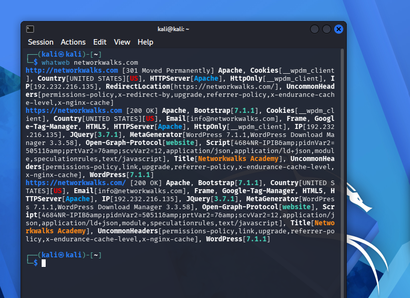

# 🛡️ Reconnaissance & Network Scanning - Week 2

## 📌 Project Overview

This phase focuses on passive footprinting, OSINT gathering, and domain reconnaissance against `networkwalks.com`. All task logs and terminal screenshots are documented below.

---

## 🛠️ Tools & Technologies Used

* **WHOIS (`whois`):** Enumerated domain registration metadata and GoDaddy name servers.
* **WhatWeb (`whatweb`):** Identified web server technologies, CMS components, and server headers.
* **NSLookup (`nslookup`):** Resolved the target domain to its public IP address mapping.
* **cURL (`curl`):** Inspected raw HTTP response headers, caching layers, and server signatures.
* **wafw00f (`wafw00f`):** Detected active Web Application Firewall protection (**ModSecurity / SpiderLabs**).
* **DNSRecon (`dnsrecon`):** Enumerated DNS record types (A, NS, MX, SOA).

---

🛡️ Purpose of the Lab

This laboratory provides a secure, self-contained workspace dedicated to practical cybersecurity training and authorized vulnerability testing.

Key capabilities and practice areas include:

-Domain footprinting and passive reconnaissance
-DNS record analysis and enumeration
-Web application fingerprinting and header analysis
-WAF detection and identification
-Log file redirection and command-line execution documentation


## 🔍 Task 1: WHOIS Domain Lookup

Performs domain registration lookup to gather registrar, creation date, name servers, and ownership details.

**Command Executed:**

```bash
whois networkwalks.com > whois-output.txt
```


---

## 🛠️ Task 2: WhatWeb Technology Detection

Identifies underlying web server technologies, CMS platforms, IP addresses, and frontend frameworks.

**Command Executed:**

whatweb networkwalks.com > whatweb-output.txt



---

## 🌐 Task 3: NSLookup Query

Queries Domain Name System (DNS) servers to reveal the target domain's primary IP address mapping.

**Command Executed:**
nslookup networkwalks.com > nslookup-output.txt


---

## 📑 Task 4: cURL HTTP Header Inspection

Fetches HTTP response headers to analyze server signatures, caching protocols, and set-cookie policies.

**Command Executed:**
curl -I [https://networkwalks.com](https://networkwalks.com) > curl-output.txt


---

## 🛡️ Task 5: WAF Detection (wafw00f)
Fingerprints the web application to determine if an active Web Application Firewall (WAF) protects the host.


**Command Executed:**
wafw00f [https://networkwalks.com](https://networkwalks.com) -o wafw00f-output.txt


---

🔎 Task 6: DNS Reconnaissance (dnsrecon)
Enumerates DNS records (A, NS, MX, SOA) and performs sub-domain enumeration.

**Command Executed:**
dnsrecon -d networkwalks.com &> dnsrecon-output.txt


---

📂 Output Verification
Confirms that all output logs were captured and non-empty.


**Command Executed:**
ls -lh *.txt

---


---

## 📂 Repository Structure

```text
.
├── curl-output.txt
├── dnsrecon-output.txt
├── nslookup-output.txt
├── wafw00f-output.txt
├── whatweb-output.txt
├── whois-output.txt
└── images/
    ├── curl-output.png
    ├── dnsrecon-output.png
    ├── file-verification.png
    ├── nslookup-output.png
    ├── wafw00f-output.png
    ├── whatweb-output.png
    └── whois-output.png
```
---


